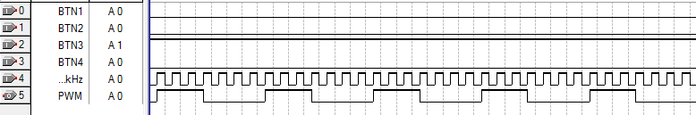

# Projet de developpement de FPGA en VHDL
Réalisé dans le cadre du master 2 SME de l'université Paul Sabatier.

## TP de bases :
Découverte du language VHDL.  
TB_Base -> Réalisation d'un compteur avec afficheur 7 segments  
PWM -> Réalisation d'un PWM avec 4 découpage possible de la fréquence

