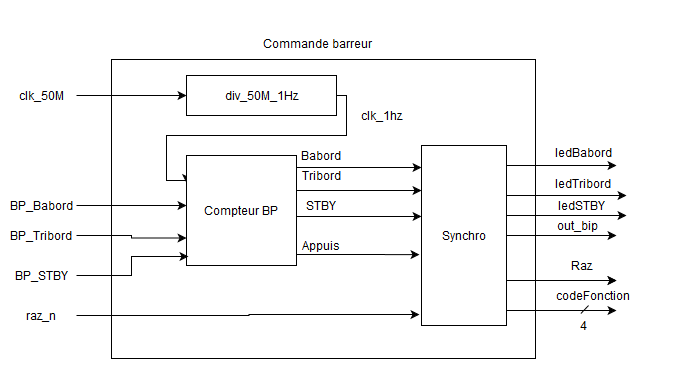

# Projet de developpement de FPGA en VHDL
Réalisé dans le cadre du master 2 SME de l'université Paul Sabatier.

## Rendu du projet prévu pour le 8 Janvier, le rapport n'est pas dans sa version finale.

## Arboressance :
Barre franche : Contient les codes VHDL des composants et des fonctions  
Barre franche > Components : Contient les différenst codes des components utilisés dans les fonctions 
Barre franche > F1 et F7 : Contient le code des deux fonctions qui est un mappage entre les différents components 
PWM : Code d'un component pour la fonction F1 
SOPC : Code SOPC des fonctions F1 et F7 
TP_Base : Regroupe les codes pour les TB de bases 
images : Images utilisés pour les descriptions 
Rapport et présentation : Contient le rapport, la présentation et la video 

## Projet Barre Franche :

### F1 Anemometre :

Analyse fonctionelle :  

### F7 Commande barreur :

Analyse fonctionelle :  

## TP de bases :
Découverte du language VHDL.  
TB_Base -> Réalisation d'un compteur avec afficheur 7 segments  
PWM -> Réalisation d'un PWM avec 4 découpage possible de la fréquence

